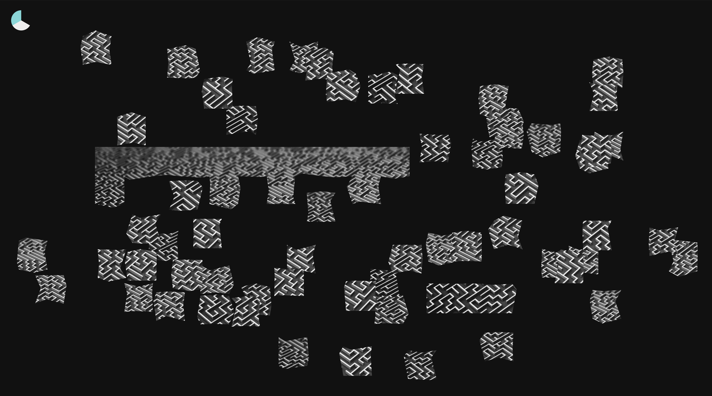

# Just Puzzles
## Table Contents  
* [Overview](#overview)
* [Getting Started](#getting-started)
* [Technologies Used](#technologies-used)
* [Screenshots](#screenshots)
* [Future Additions](#future-additions)
---
---

## Overview  
*Just Puzzles* is an online source for puzzles that takes an image and breaks it up into the number of pieces and piece shape specified by the user. As the admin, I can upload many images ahead of time and have them released upon the date given to each image for a hands-off daily update. The puzzle mechanics and image selections were designed to create a enjoyable, relaxing and satisfying user experience.

---
---
## Getting Started  
Here is the link for
[Just Puzzles](https://just-puzzles.herokuapp.com/)  

---
---
## Technologies Used  
* Frontend
  * Javascript
  * HTML
  * CSS
  * React
* Backend
  * Node.js
  * Express.js
  * MongoDB/Mongoose.js
* Services
  * AWS
  * Atlas
  * Heroku

---
---
## Screenshots

#### Home Page shows all of the available puzzles in order from newest to oldest
 
#### Options Page gives the user the chance to change the puzzle piece style and count
 
#### Play Page is where the user can put the puzzle together
 

---
---
## Future Additions:  
* Add more puzzle piece styles, including the classic jigsaw shapes
* Add a timer that will start when the user first clicks a piece and ends when the puzzle is completed
* Add a the fastest completion time for each puzzle, shown on the homepage
* Add a counter for the number of times a puzzle has been completed
* Include catagories which the user can filter the puzzles by